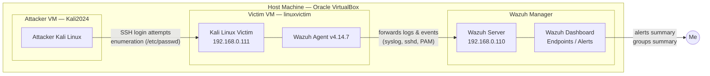
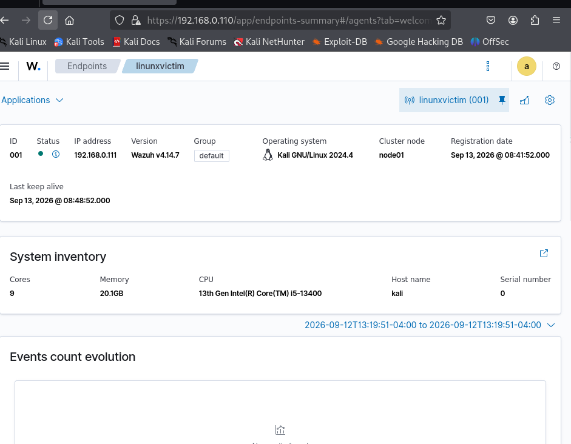
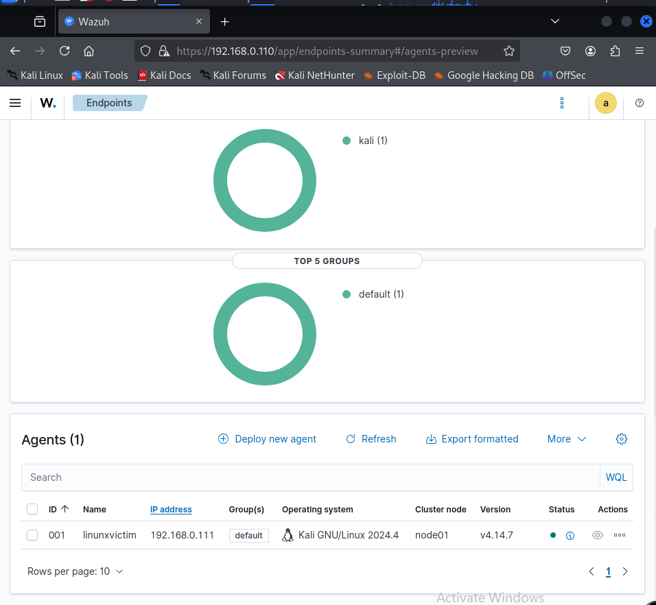
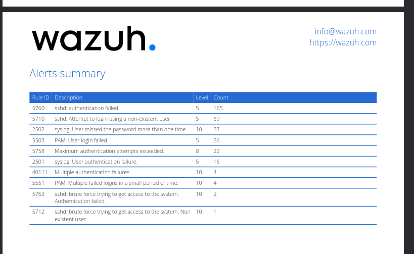
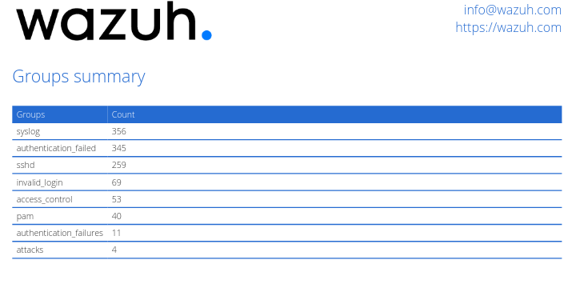
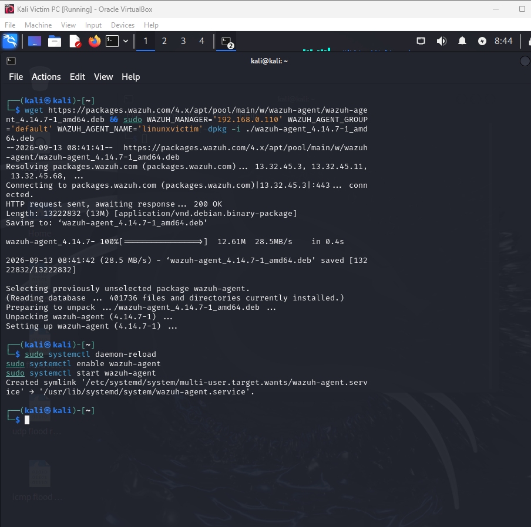
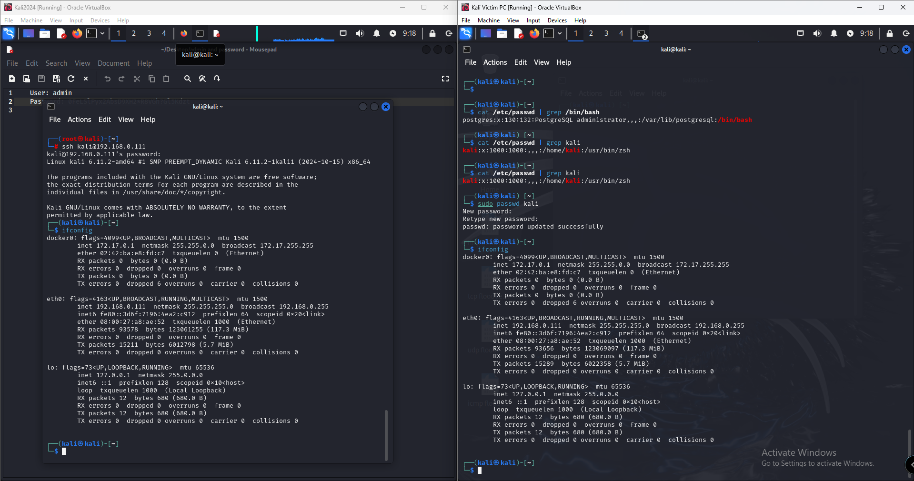

# Home Lab SIEM: Attack Detection with Wazuh

A self-built home lab where I deploy Wazuh as a SIEM to monitor a Kali Linux "victim" host, simulate SSH brute-force and enumeration activity from a separate "attacker" VM, and confirm the attacks are actually detected and logged.

## Architecture

**Flow in plain terms:** the attacker VM targets the victim VM over SSH on an isolated internal network. The Wazuh agent installed on the victim ships its logs (SSH, PAM, syslog) to the Wazuh manager, which correlates them into rules and alerts I can review on the dashboard.

## What I Built and Why

**1. Isolated network** — Both VMs run in Oracle VirtualBox on a shared internal network (`192.168.0.0/24`) with no route to my main LAN, so any "attack" traffic stays contained.

**2. Victim host (`linuxvictim`, 192.168.0.111)** — A Kali Linux VM configured as the machine being monitored. I registered it with the Wazuh manager, installed the agent, and pointed it at the manager's IP so its activity would be visible centrally instead of only in local logs.

**3. Wazuh manager (192.168.0.110)** — The SIEM brain. It receives events from the agent, groups the host under the `default` group, and gives me a dashboard (Endpoints, Alerts, Events) instead of having to tail log files by hand.

**4. Attacker host (`Kali2024`)** — A second Kali VM used purely to generate traffic against the victim: repeated SSH logins, login attempts with non-existent usernames, and basic enumeration (`cat /etc/passwd`, checking shells, `ifconfig`) once inside, so I'd have something meaningful for the SIEM to detect.

**5. Verification** — Rather than assuming the pipeline worked, I pulled the alerts and groups summaries from Wazuh to confirm the manager actually correlated the raw SSH/PAM/syslog noise into real, countable security events.

## Proof It Works

**Agent registered and reporting to the manager**

The victim host `linuxvictim` shows as an active agent (ID 001) on Wazuh v4.14.7, Kali GNU/Linux 2024.4, with a live "last keep alive" timestamp — confirming the agent-to-manager connection is up.

**Endpoints overview**

The dashboard confirms exactly one active agent in the `default` group, matching my lab setup.

**Alerts summary — the attack being detected**

This is the key proof: 165 failed SSH authentications, 69 login attempts against non-existent users, 37 syslog password failures, and several rules explicitly labelled "brute force trying to get access to the system" — generated by the attacker VM and picked up automatically by Wazuh's rule engine.

**Groups summary — categorised by rule type**

Wazuh rolls the same raw events up into categories (`sshd`, `authentication_failed`, `pam`, `attacks`), which is what let me confirm this wasn't just noise — it was consistently classified as authentication attacks.

**Installing the agent on the victim**

Terminal output of pulling the Wazuh agent package and installing it with `dpkg`, then enabling and starting the `wazuh-agent` service with `systemctl`.

**Attacker interacting with the victim**

Side-by-side view: the attacker VM SSHing into the victim, then basic post-login enumeration (`cat /etc/passwd`, checking `kali`'s shell, `ifconfig`) — the activity that generated the alerts above.

## Lessons Learned

- **A dashboard is only useful once you trust the pipeline end-to-end.** Seeing the agent's green "active" status wasn't enough for me — I only trusted the setup once I could trace a specific action (a failed SSH login) all the way to a specific alert with a rule ID.
- **Raw logs and SIEM alerts are not the same thing.** SSH auth failures and PAM messages are just log lines by themselves; Wazuh's value is the rule engine turning repeated low-level events (single failed logins) into higher-level, higher-severity alerts (like rule 5763, "brute force trying to get access to the system").
- **Isolating the lab network mattered more than I expected.** Running the attack traffic on an internal-only VirtualBox network meant I could be as aggressive as I wanted with brute-force attempts without any risk to my host machine or home network.

## A Problem I Hit — and How I Fixed It

**Problem:** After installing the Wazuh agent on the victim VM, it initially wasn't clear whether the agent was actually communicating with the manager, since a fresh install doesn't guarantee the service is enabled or running.

**Fix:** I explicitly ran the full service lifecycle instead of assuming the installer handled it — `sudo systemctl daemon-reload`, `sudo systemctl enable wazuh-agent`, then `sudo systemctl start wazuh-agent`. I then confirmed the fix worked by checking the agent's status and "last keep alive" timestamp on the Wazuh dashboard, rather than just trusting the terminal output.

## What I'd Improve Next

- **Add a Windows victim endpoint** alongside the Kali Linux one, so the lab covers Sysmon/Windows Event Log detections, not just Linux SSH/PAM/syslog.
- **Write custom Wazuh detection rules** instead of relying only on the built-in ruleset, to practice the analyst skill of tuning rules to reduce false positives.
- **Add active response** (e.g. auto-blocking an IP after repeated brute-force alerts) to move from passive detection to automated response.
- **Correlate with a firewall/pfSense log source** so alerts can be cross-checked against network-layer blocking, not just host-layer authentication logs.
- **Document a full incident report** for one of the simulated brute-force attacks, treating it as a real SOC alert triage exercise from detection through to write-up.
