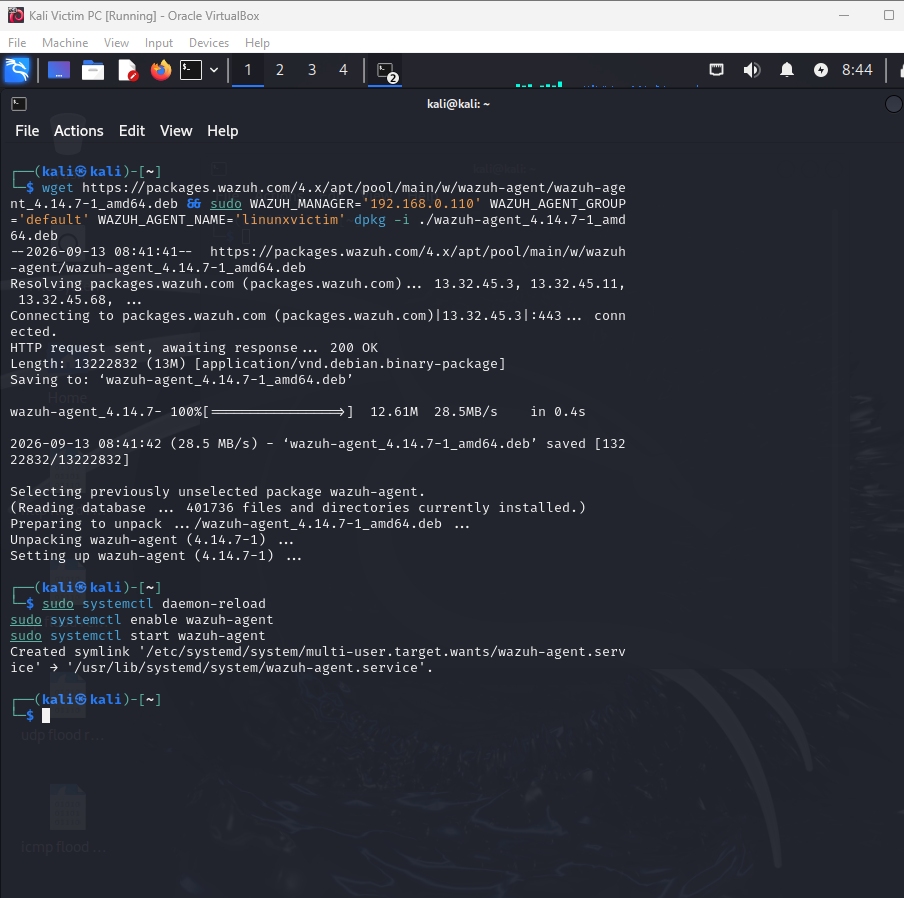
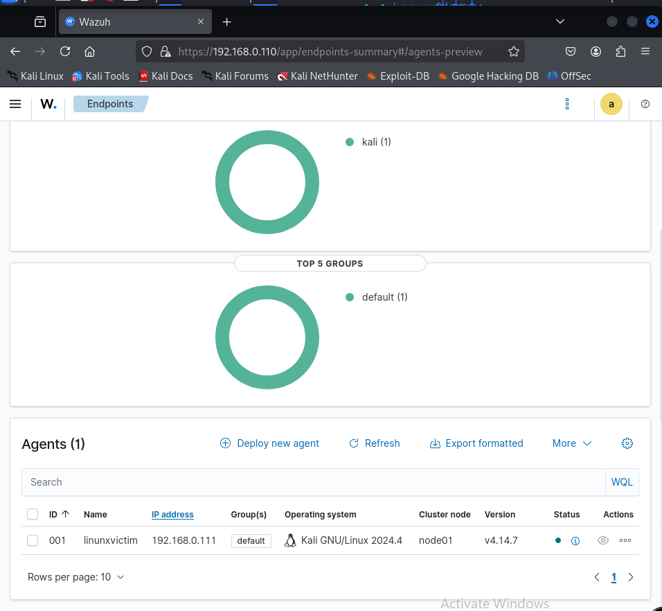
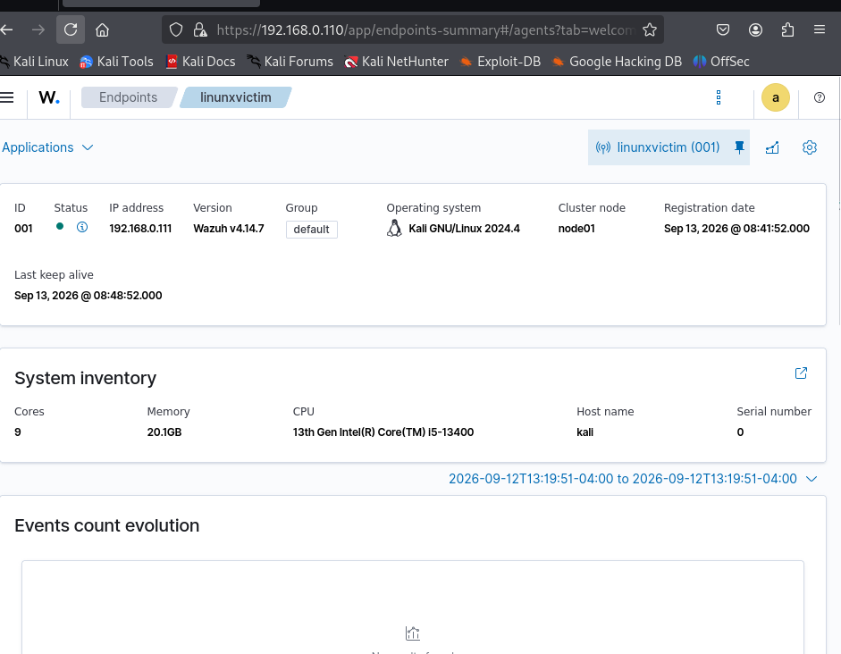
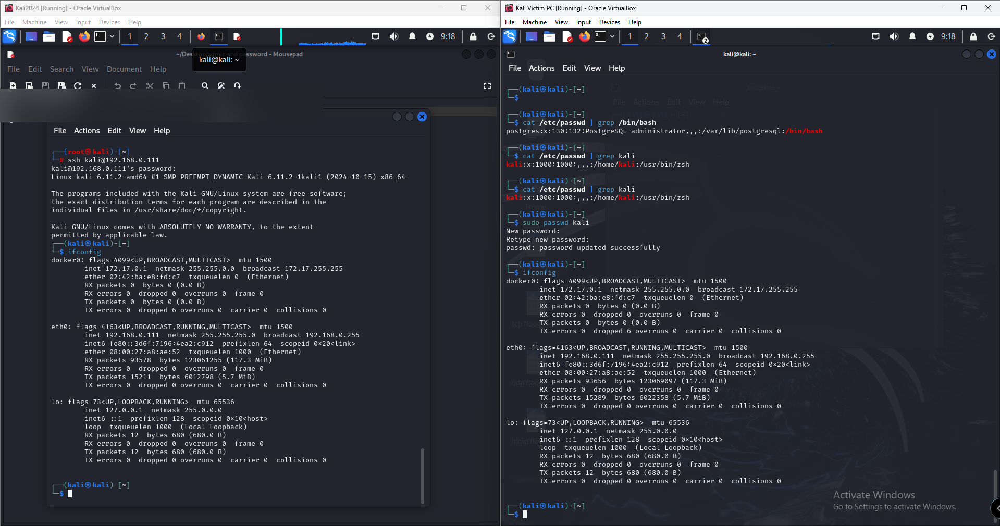
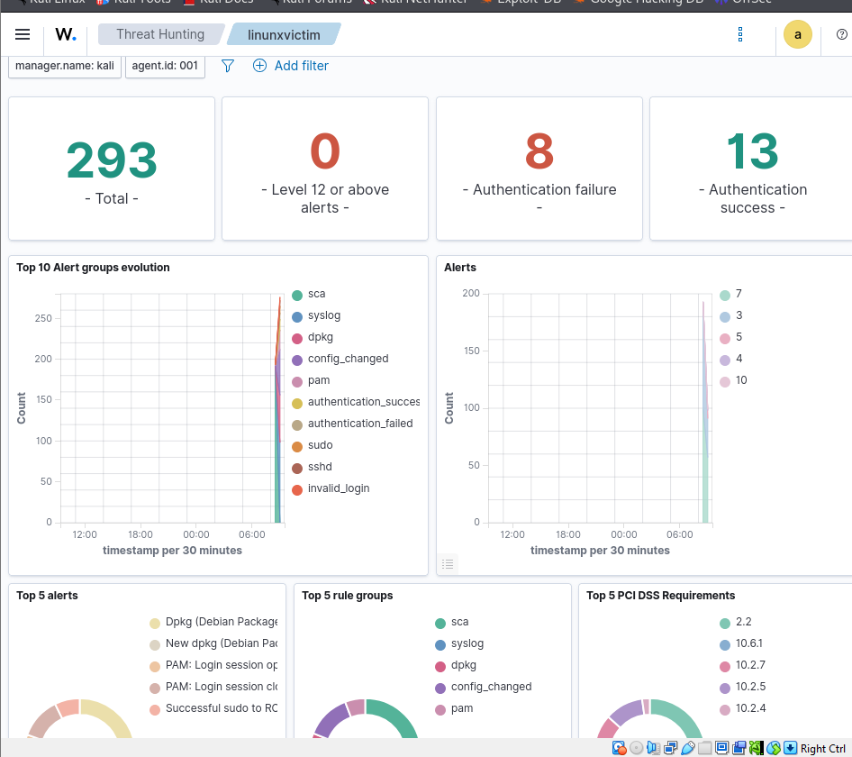
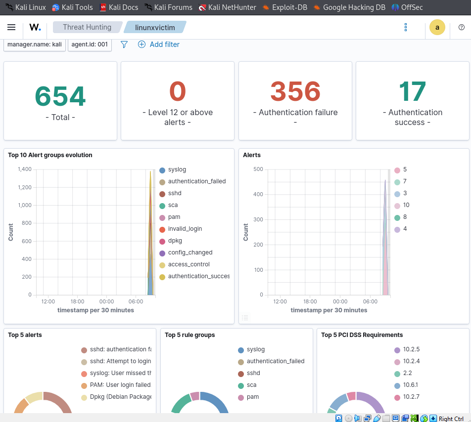
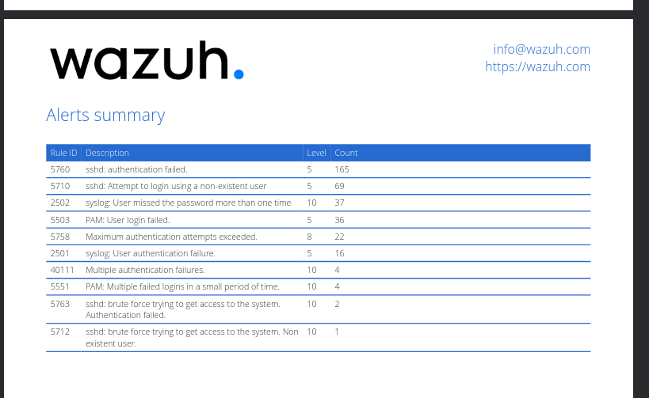
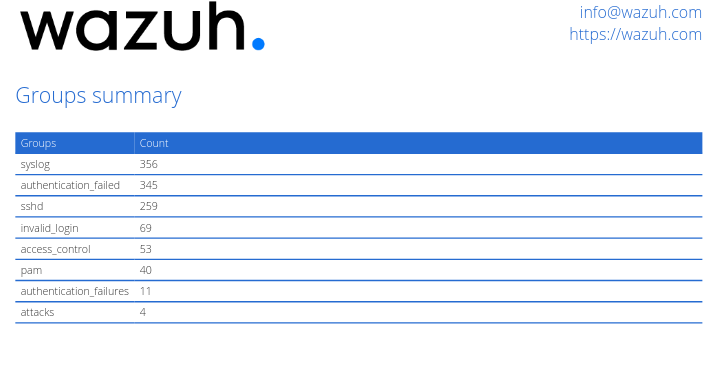
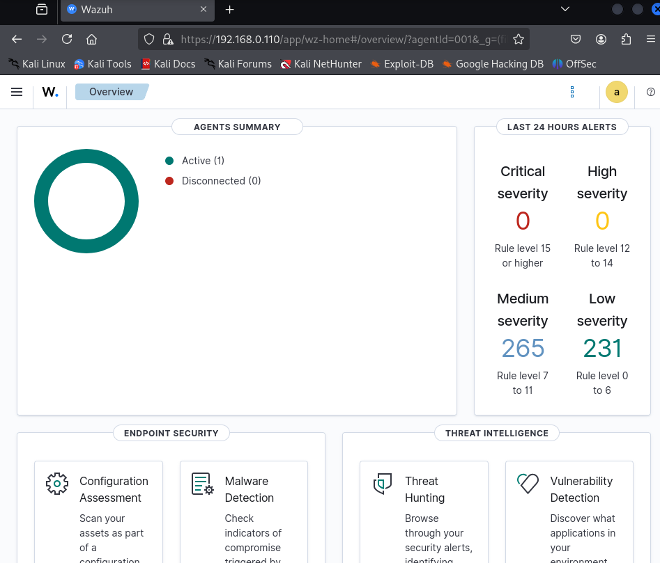

# SSH-Bruteforce-Detection-Wazuh-Lab

A two-VM home lab simulating a real-world SSH brute-force attack and measuring how a SIEM (Wazuh) detects it. Built to demonstrate the full attack-to-detection pipeline: baseline logging, attack simulation, and SIEM correlation analysis.

> ⚠️ **Disclaimer:** This project was conducted entirely within an isolated virtual lab environment that I own and control. All attacks were run against my own virtual machines for educational purposes only. Do not run these tools against systems you do not own or have explicit permission to test.

---

## Overview

| | |
|---|---|
| **Goal** | Simulate an SSH brute-force attack and validate detection using a SIEM |
| **Attacker/Manager VM** | Kali Linux 2024, Wazuh manager v4.14.7 |
| **Victim VM** | Kali Linux 2024, OpenSSH 10.4p1, Wazuh agent v4.14.7 |
| **Network** | Isolated virtual network, 192.168.0.0/24 (VirtualBox) |
| **Tools used** | Hydra, OpenSSH, Wazuh (manager + agent), VirtualBox |

## Architecture

```
┌─────────────────────┐         ┌──────────────────────┐
│   Attacker VM         │         │    Victim VM           │
│   (Kali Linux)        │  SSH    │    (Kali Linux)        │
│                       │────────▶│                        │
│  - Wazuh Manager      │  :22    │  - OpenSSH Server      │
│  - Wazuh Dashboard    │         │  - Wazuh Agent         │
│  - Hydra              │◀────────│                        │
│                       │ agent   │                        │
│  192.168.0.110        │ :1514   │  192.168.0.111         │
└─────────────────────┘         └──────────────────────┘
```

## Methodology

### 1. Environment setup
- Deployed two Kali Linux VMs on a shared isolated virtual network
- Installed the Wazuh all-in-one stack (manager, indexer, dashboard) on the attacker VM
- Installed OpenSSH server on the victim VM and enabled/started the service
- Installed and enrolled the Wazuh agent on the victim VM, pointed at the manager's IP


*Installing and starting the Wazuh agent on the victim VM.*

- Confirmed agent enrollment via the Wazuh dashboard


*Wazuh Endpoints page showing the victim (`linunxvictim`) enrolled and active.*


*Agent detail view: IP, OS, version, and registration date.*

### 2. Establishing a baseline
Before running any attack, I generated legitimate SSH login traffic from the attacker VM to the victim to confirm normal authentication events were being logged correctly. This gives a clean "before" state to compare the attack traffic against.


*Confirming SSH access from the attacker VM to the victim as the `kali` user.*

**Baseline result:** 13 successful authentication events, 8 failed (from earlier setup/troubleshooting attempts).


*Wazuh Threat Hunting view showing baseline authentication activity.*

### 3. Attack simulation
Ran a Hydra dictionary attack against the victim's SSH service using the `rockyou.txt` wordlist:

```bash
hydra -l notarealuser -P /usr/share/wordlists/rockyou.txt -t 4 ssh://192.168.0.111
```

Notes from this step:
- Initial runs with higher thread counts (`-t 16`) were rejected by the victim with connection resets
- Investigation showed this was **not** a firewall or fail2ban block, but OpenSSH 9.8+'s built-in per-source penalty system automatically throttling a source IP generating rapid authentication failures
- Reducing to `-t 4` allowed the attack to proceed while still triggering detection

### 4. Detection analysis
After the attack, I reviewed the Wazuh dashboard's Threat Hunting view and generated an alert summary report.


*Dashboard showing the spike in authentication failures during the attack window (356 failures vs. baseline of 8).*

**Results:**

| Rule ID | Description | Level | Count |
|---|---|---|---|
| 5760 | sshd: authentication failed | 5 | 165 |
| 5710 | sshd: attempt to login using a non-existent user | 5 | 69 |
| 2502 | syslog: user missed the password more than once | 10 | 37 |
| 5503 | PAM: user login failed | 5 | 36 |
| 5758 | Maximum authentication attempts exceeded | 8 | 22 |
| 2501 | syslog: user authentication failure | 5 | 16 |
| 40111 | Multiple authentication failures | 10 | 4 |
| 5551 | PAM: multiple failed logins in a small period of time | 10 | 4 |
| **5763** | **sshd: brute force trying to get access to the system (authentication failed)** | **10** | **2** |
| **5712** | **sshd: brute force trying to get access to the system (non-existent user)** | **10** | **1** |


*Full alert summary report generated by Wazuh.*


*Alert groups summary, showing volume by category (syslog, authentication_failed, sshd, pam, attacks, etc).*

Authentication failures rose from a baseline of **8** to **356** during the attack window, and Wazuh escalated the pattern into dedicated level-10 brute-force correlation rules (5763, 5712), rather than only logging isolated low-severity failures.

## Overview Dashboard


*Wazuh's main overview dashboard showing agent summary and 24-hour alert severity breakdown.*

## Key Findings / What I Learned

- **SIEM correlation vs. raw logging** — individual failed logins are low severity on their own; a SIEM's real value is correlating a *pattern* of failures from the same source into a higher-severity brute-force alert.
- **Modern OpenSSH has built-in defenses** — OpenSSH 9.8+'s per-source penalty system throttled Hydra's parallel connections mid-attack. What initially looked like a broken attack was actually the server auto-mitigating it, worth documenting as a defense layer in its own right.
- **Environment troubleshooting is part of the job** — debugging missing SSH installs, disabled root login, wrong usernames, and Hydra connection resets was as instructive as the attack itself.
- **Read dashboard filters carefully** — an early "my login isn't showing up" moment turned out to be a dashboard view scoped only to authentication failures, a reminder to check what a SIEM view is actually querying before concluding something is broken.
- **Baselines make anomalies provable** — without the clean 13/8 baseline, the 356-failure spike during the attack would have no reference point to demonstrate it was anomalous.

## Possible Extensions

- Configure Wazuh **active response** to automatically block the attacker's IP via `iptables`/`firewall-drop` once a level-10 brute-force rule fires, and re-run the attack to show the block in action
- Add a custom Wazuh rule/decoder to detect SYN flood traffic patterns (see companion project below)
- Enable Wazuh File Integrity Monitoring (FIM) on `/etc` and demonstrate detection of unauthorized file changes

## Related Project

This lab pairs with my SYN Flood Testing Lab (offensive/DoS side) to demonstrate exposure to both attack simulation and detection engineering.

## Tools Reference

- [Hydra](https://github.com/vanhauser-thc/thc-hydra) — network login brute-forcer
- [Wazuh](https://wazuh.com/) — open-source SIEM and XDR platform
- [Kali Linux](https://www.kali.org/) — penetration testing distribution
